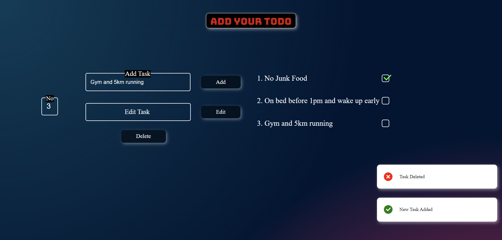

# Project-P1

Welcome to **Project-P1**, a practice project aimed at honing my skills in HTML, CSS, and JavaScript. As the name suggests, **P1** stands for "Practice Project 1," designed to solidify my understanding of key web development concepts.
## 📸 Screenshot



## 📚 Overview and Technology Stack

This project is part of **Cohort 3.0, Week 3 Assignment**. It focuses on utilizing the following technologies and concepts:

- **HTML**: Structure and semantics.
- **CSS**: Styling and layout.
- **JavaScript**: 
  - **DOM Manipulation**: Dynamic interaction with the document structure.
  - **Asynchronous JavaScript**: Handling tasks that take time to complete.

## 🚀 Features
- Interactive elements powered by DOM manipulation.
- Asynchronous operations for enhanced user experience.

## 🛠️ Bugs
- Not a Responsive design
- There are some limitations to the design

## 📂 Project Structure

```plaintext
Project-P1/
│
├── index.html         # Main HTML file
├── style.css          # CSS file for styling
├── script.js          # JavaScript file for interactivity
├── screenshort.png    # Project screenshot
└── README.md          # Project documentation
